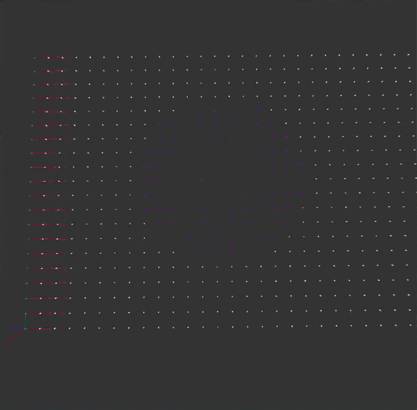

A d3q27 lattice boltzmann fluid simulation written in c++ 
with a graphical frontend written in C# using the MonoGame framework

reqiures the sycl runtime, (libsycl.so.8)
one of the ways to get it is to install the oneapi base toolkit:
https://www.intel.com/content/www/us/en/developer/tools/oneapi/base-toolkit-download.html

after installing the toolkit find the oneapi-vars.sh script (for me it is in /opt/intel/oneapi/2025.0)
and run:
source oneapi-vars.sh

then run either the ./save_to_file executible 

or the ./save_to_file_amd executible 
(which may or may not work due to the use of a script from codeplay to add the ability to use AMD GPUS)